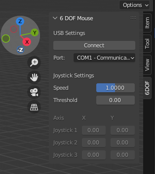

# 🖱️ Blender6DofMouseAddon 🐭

## Introduction 🚀

Blender add-on for the [6 DOF CAD mouse I'm building](https://github.com/NangiDev/6DofMouse)

It reads serial data from the mouse and transform it to translation and rotation data inside Blender to move stuff inside the viewport.

## Dependencies 📦

- Blender 2.8 or greater
- Pyserial 3.2 or greater

### Install PySerial for Blender

- Download the [PySerial source code](https://pypi.org/project/pyserial/#files). The file you're looking for ends with .tar.gz
- Unzipp what you've downloaded
- Copy the serial folder, it is under PySerial\pyserial-3.2.1\serial (the version can change)
- Paste the folder in your blender modules folder, 2.83\scripts\modules,
  and now you should be able to use import serial

## Actuall Blender Add-on 🧩

### [viewport_control.py](viewport_control.py)

This is the actuall add-on to install

## UI Description 📜

- Connect button - Connect to your mouse
- Port dropdown - The serial port the mouse is connected to
- Speed variable - A multiplier for adjusting mouse speed inside Blender
- Threshold variable - To remove drifting in joysticks
- Grayed out axises - Normalized (-1 to 1) real-time data being read from the joystics.

## Screenshot 📷

# Tests

Some small Python program I wrote to be able to iterate faster

### [Read Simulator](tests/read_simulator.py)

This is a simple python program that reads from serial. Useful for testing and you don't want to do it through Blender add-on

### [Write Simulator](tests/write_similator.py)

This is a simple python program that writes to serial. Useful for testing and you don't have you Arduino hardware
